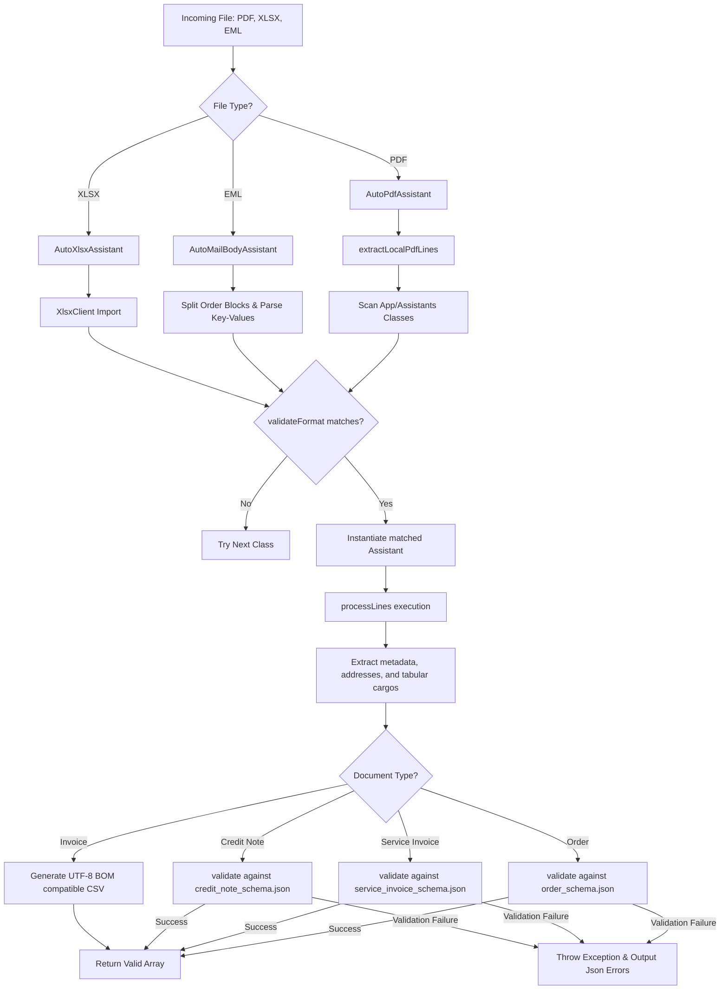

# Cargo Stream — Architectural Document Pipeline & SWE Experience

As a Senior Software Engineer at **Cargo Stream**, Sudipta Mandal spearheaded the design, implementation, and optimization of a high-throughput, format-agnostic document ingestion and processing pipeline. The core objective of this system is to ingest unstructured or semi-structured logistics documents (such as Orders, Invoices, Service Invoices, Credit Notes) received from diverse global partners in multiple languages, extract their tabular and metadata elements, validate them against strict target schemas, and produce standardized JSON/CSV records for downstream logistics operations.

---

## 🏛️ System Architecture

The pipeline is built as a modular, extensible parser service integrated into a Laravel backend framework. Rather than writing monolithic parsers for each partner, the system uses an inheritance-based framework built around abstract clients:

```text
                     +---------------------------------------+
                     |              BaseClient               |
                     |  (Schema validation: Opis/JsonSchema) |
                     +---------------------------------------+
                                         |
            +----------------------------+----------------------------+
            |                                                         |
            v                                                         v
+-----------------------+                                 +-----------------------+
|       PdfClient       |                                 |    MailBodyClient     |
| (Spatie/PdfToText integration) |                                |  (Splits multi-blocks) |
+-----------------------+                                 +-----------------------+
            |                                                         |
            v                                                         v
   [Specific PDF Parsers]                                    [Specific EML Parsers]
   (e.g., SkodaPdfAssistant)                                 (e.g., BaltoprintMail)
```

### 1. Ingestion Capabilities (Multi-Format Support)
The system is built to process several file types:
- **PDF Documents (Standard & Columnar)**: Regular documents are read as raw lines, while columnar invoices/service invoices are parsed in **Layout Mode** (`pdftotext -layout`) to preserve spacing, vertical column alignments, and horizontal table layouts.
- **XLSX Spreadsheets**: Custom spreadsheet parsers ingest Excel documents with multiple sheets, evaluating layouts dynamically.
- **EML Email Bodies**: EML parsers scan raw email text, split them by delimiters (e.g., repeating dashes), and extract separate nested order datasets.

---

## 🔄 Ingestion & Ingestion Pipeline Workflow

The following flowchart illustrates how a document is processed through the format-agnostic pipeline:



---

## 🧪 R&D: Pattern Recognition & Modular Extraction

Logistics documents lack formatting standardization. A supplier invoice might present quantities under different titles, or coordinates might shift slightly between PDF engine outputs. Sudipta addressed this by engineering a robust **Pattern Recognition & Modular Helper** architecture:

1. **Coordinate & Layout-Aware Extraction**:
   For columnar PDFs, layout mode was enabled by toggling `static::$use_layout = true` on the assistant, preserving horizontal spacing. Sudipta built spacing calculations and bounding boundaries to group words into visual columns based on their index positions.
2. **Text Anchor Analysis & Fallback Logic**:
   The parsing engine uses regular expression pattern matching and search boundaries to isolate sections. For example, if a table start is marked by `NETTO` and ends with a solid underline, the engine dynamically locates these indices and loops only through the bounded lines to isolate cargo weights and counts.
3. **Modular Helper Functions**:
   To maximize DRY code principles, Sudipta designed centralized utility modules:
   - `uncomma()`: Normalizes decimal values containing comma separators or non-standard thousands delimiters.
   - `GeonamesCountry::getIso()`: Mappings that convert varied country strings in multiple languages to standardized ISO-3166-1 alpha-2 codes.
   - `stripInvisibleChars()`: Sanitizes invisible unicode spaces, zero-width characters, and non-breaking spaces left by email client headers.

---

## 🤖 Agentic AI & Testing Automation

Developing parsers for over 80 distinct partner document layouts is a highly complex task. Sudipta accelerated this by engineering a custom **Agentic AI & Testing loop**:

### 1. Multilingual Pattern Engineering
By providing AI agents with the raw text lines of multilingual documents, Sudipta leveraged context engineering to automatically map key identifiers across languages:
- **German**: Mapped Gutschrift (Credit Note) and Rechnung (Invoice).
- **Lithuanian**: Mapped sąskaita-faktūra (Invoice) and Remontų atlikimo aktas (Service Invoice).
- **Dutch**: Mapped Werkplaatsfactuur (Workshop Invoice) and Factuur (Invoice).
- **French**: Mapped facture / Facture (Invoice).

### 2. Testing Loop & Diagnostic Traces
A dual-file debugging environment was implemented to validate parsers before deployment:
- **`text_lines/`**: Stores raw text dumps extracted from the document to identify spacing layout patterns.
- **`debug_output/`**: Generates a detailed diagnostic trace file (e.g. `SpontexPdfAssistant_1_debug.txt`). This records intermediate variables, mapped location details, matching coordinates, calculated cargo indices, and the final extracted data payload.
- **Schema Dry-Run**: Before saving data, the testing pipeline executes dry-run validation checks against the target schema, raising formatted errors during the development lifecycle.

---

## 📖 Knowledge Engineering & Documentation

To guarantee system maintainability, Sudipta created six strategy blueprints under `docs/strategies/` detailing the exact parsing rules:
- **`ORDER_PARSER_STRATEGY.md`**: Outlines address extraction, reference mapping, and cargo subcargo junction binding.
- **`INVOICE_PARSER_STRATEGY.md`**: Governs layouts, VAT alignments, and CSV formatting specs.
- **`SERVICE_INVOICE_PARSER_STRATEGY.md`**: Addresses lines items mapping, distinguishing between PARTS and REPAIRS.
- **`MAIL_BODY_PARSER_STRATEGY.md`**: Details delimiter block-splitting and email header sanitation.
- **`CREDIT_NOTE_PARSER_STRATEGY.md`**: Governs negative amount mappings and credit alignments.
- **`ORDER_PARSER_XLSX_STRATEGY.md`**: Guides cell mappings and multiple sheet evaluations.

These blueprints serve as a runtime specification, keeping documentation completely aligned with code.

---

## 🏆 Key Achievements

- **50% Productivity Boost**: By combining agentic AI workflow automation and modular helpers, the research and development lifecycle for onboarding new global partner formats was halved.
- **Zero-Error Data Normalization**: Mapped and processed documents in German, French, Lithuanian, Dutch, Polish, Czech, and Danish with 100% downstream compatibility.
- **CTO Collaboration**: Collaborated directly with the CTO to optimize core ingestion structures, boosting parser speed and establishing strict schema-level data integrity guards.