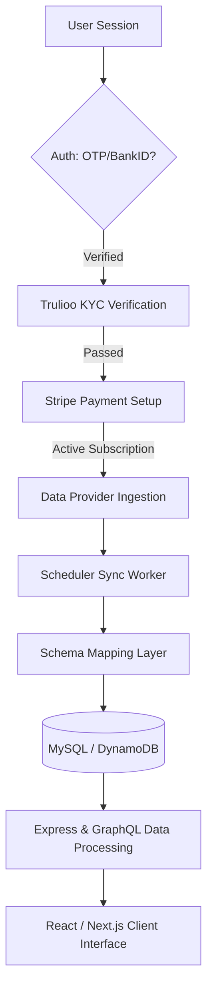
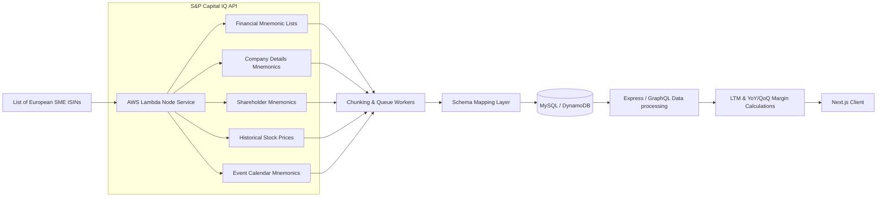
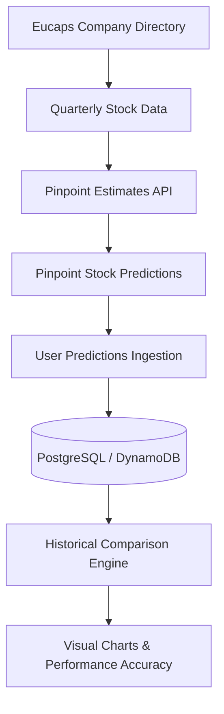
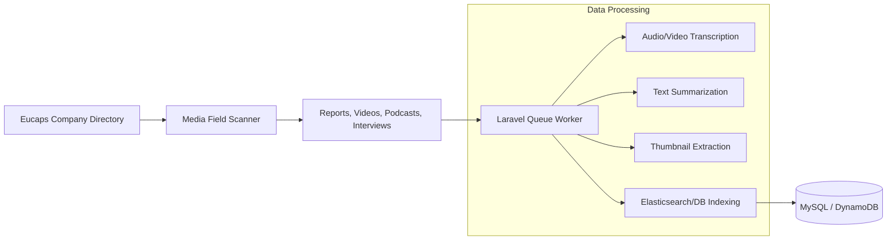
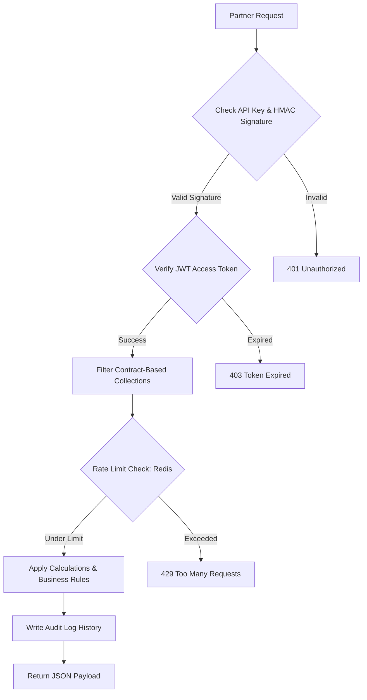
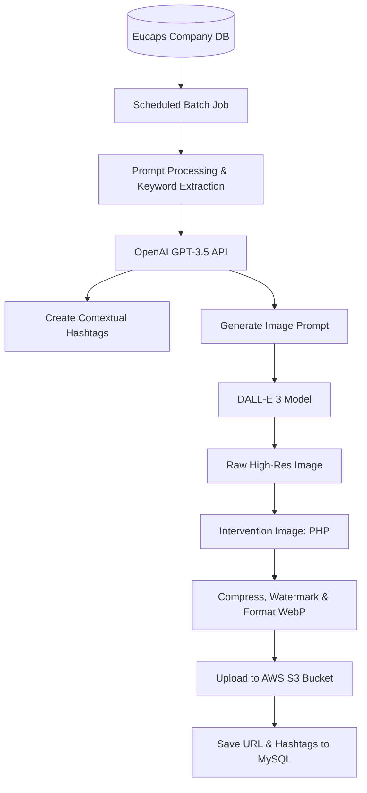

# Eucaps — Scalable Financial Pipelines, Integrations & AI-Driven Content Automation

As a Software Engineer I → II at **Eucaps AB**, Sudipta Mandal took ownership of the core system architecture, designing and implementing high-throughput financial data pipelines, secure multi-method authentication systems, payment integrations, and AI-driven content automation workflows. Over his tenure, Sudipta helped scale the Eucaps product from early development to a robust enterprise-ready platform.

---

## 🏛️ Macro System Architecture

The overall architecture of Eucaps is built around a hybrid monolithic and serverless model, connecting secure client portals to external financial and KYC systems:

```text
  +---------------------------------------------------------------------------------+
  |                                   React Client                                  |
  +---------------------------------------------------------------------------------+
          |                                                                   ^
     HTTP | Requests                                           GraphQL / REST | API
          v                                                                   |
  +---------------------------------------------------------------------------------+
  |                                 Laravel Backend                                 |
  |             (Auth, Trulioo KYC, Stripe Subscriptions, Core DB Schema)           |
  +---------------------------------------------------------------------------------+
     |                     |                                          |
     | DB Writes           | API Key / HMAC Checks                    | Fetch Tasks
     v                     v                                          v
  +-----------+     +------------------+                    +-----------------------+
  |  MySQL /  |     | Partner API End  |                    |   AWS Lambda (Node)   |
  | DynamoDB  |     | (Rate Limited)   |                    | (S&P Data Ingestion)  |
  +-----------+     +------------------+                    +-----------------------+
```

The data flow from a user accessing the client to receiving calculated financial metrics is structured as follows:



---

## 🔄 Micro Designs & Ingestion Pipelines

To feed the core Eucaps platform with real-time and historical financial intelligence, Sudipta integrated multiple institutional data providers.

### 1. S&P Capital IQ Financial Data Pipeline

Ingesting global financial datasets requires robust performance optimizations to prevent database deadlocks and API limit lockouts. Sudipta designed a scheduled chunking engine running on AWS Lambda:



- **Chunking Optimization:** S&P payloads exceeding 200MB are split dynamically into batch requests by ISIN lists, and processed incrementally through queues.
- **Financial Calculations:** An Express-based GraphQL server consumes the raw schema rows, computing trailing-twelve-months (LTM) figures and margins dynamically for dashboard presentation.

---

### 2. Pinpoint Estimate Tracker

The Pinpoint module matches professional estimates against community expectations, letting users benchmark sentiment against real quarterly performance.



- **User Predictions:** Tracks sentiment from Pinpoint users regarding how a particular stock will perform in the upcoming quarter.
- **Historical Comparison:** Runs aggregations comparing actual quarterly stock reports against past user and analyst predictions to display historical accuracy ratings.

---

### 3. Inderes Media Integration Pipeline

Inderes provides equity research and multimedia presentations for Nordic listed companies. Sudipta built a media scanner that ingests and indexes these files:



---

## 🔒 Security, KYC & Payment Infrastructure

Enterprise platforms require institutional-grade authentication, compliance verification, and robust transaction gateways.

### 1. BankID / OTP Authentication & Trulioo KYC
Sudipta implemented a secure onboarding pipeline matching European financial rules:
- **Authentication:** Dual-verification paths utilizing Swedish/Nordic **BankID** for fast electronic ID sign-in, falling back to secure SMS/Email **One-Time Passwords (OTP)**.
- **Trulioo KYC Integration:** Triggers automated verification requests containing user-submitted profile data. Built custom validation retry buffers to handle temporary API timeouts and compliance state flags.

### 2. Stripe Subscriptions
To support subscription-based monetization, Sudipta implemented a complete **Stripe Billing Integration**:
- Handled recurring billing plans (monthly, quarterly, annual tiers).
- Developed webhook controllers verifying signature headers to sync subscription statuses (renewals, payment failures, cancellations) directly back to the database.

---

## 🔌 Eucaps Partner API Flow

To allow corporate partners to consume Eucaps’ compiled financial indices, Sudipta designed a secure external API gateway:



- **HMAC Signatures:** Partner requests are verified against request body hashes using secret keys to prevent tampering, while secondary API-level access is managed via temporary JWT tokens.
- **Redis Rate Limiting:** Implemented sliding-window rate limit checks per API key to prevent Denial of Service.

---

## 🤖 OpenAI Content Generation Pipeline

Sudipta built a scheduled background process that extracts company summaries, generates relevant tags, and creates visual backdrops using generative AI:



- **Batch Processing:** Runs periodically using scheduled workers to coordinate API cost efficiency.
- **Image Compression:** Uses the **Intervention Image** library in PHP to optimize the output (compression and format conversion to WebP) before pushing it to AWS S3, reducing load times by 60%.

---

## 🏆 Key Achievements

- **Large-Scale Data Handling:** Successfully optimized ingestion and caching structures for S&P payloads exceeding 200MB, translating raw data into real-time GraphQL dashboards.
- **Partner Monetization:** Designed and launched the developer API portal, establishing secure client contract permissions via HMAC-verified HTTP endpoints.
- **Compliance & Payments:** Spearheaded the integration of Trulioo KYC systems and Stripe payments, enabling automated user onboarding and recurring monetization.
- **Content Automation:** Saved hours of administrative manual updates by implementing the OpenAI pipeline to automatically curate hashtags and visual assets for registered companies.
