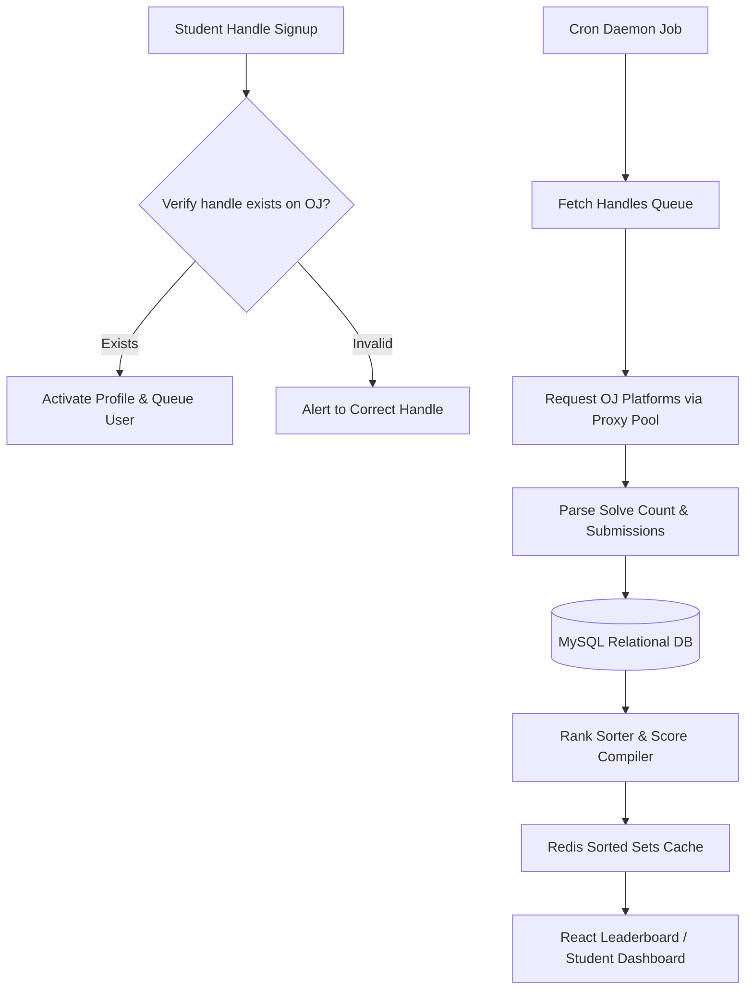
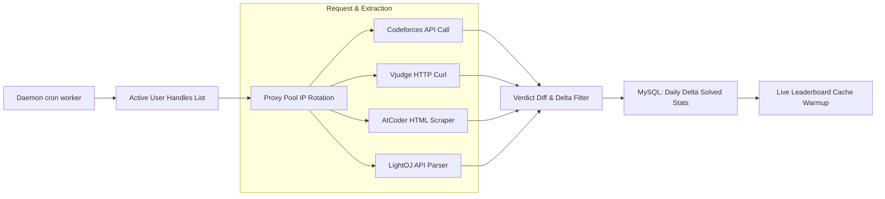
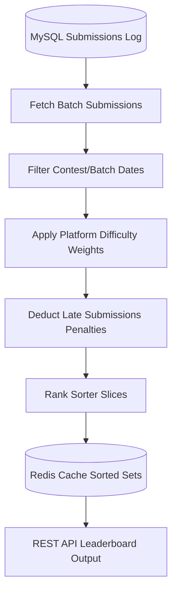

# NSUPS — Bootcamp Tracker, Automated Crawlers & Relational Backends

As a Junior Software Engineer (Volunteer) at **NSUPS** (North South University Programming Society), Sudipta Mandal developed the backend services for the Bootcamp participant management portal, engineered automated Online Judge (OJ) submission crawlers, and built student progress metrics dashboards.

---

## 🏛️ Macro System Architecture

The NSUPS Bootcamp tracker uses a centralized REST API backend connected to automated scraper worker threads and student dashboards:

```text
  +---------------------------------------------------------------------------------+
  |                                 React Dashboard                                 |
  +---------------------------------------------------------------------------------+
          |                                                                   ^
     HTTP | Requests                                           REST JSON APIs | Responses
          v                                                                   |
  +---------------------------------------------------------------------------------+
  |                                 Laravel Backend                                 |
  |             (Participant Registry, Verification Gate, Leaderboard Engine)       |
  +---------------------------------------------------------------------------------+
      |                     |                                          ^
      | DB Writes           | HTTP request / proxies                   | Solves data
      v                     v                                          |
  +-----------+     +--------------------+                    +---------------------+
  |   MySQL   |     |   Scraper Daemon   | -----------------> |    Online Judges    |
  |  Storage  |     |   (Cron Worker)    |                    | (Codeforces, etc.)  |
  +-----------+     +--------------------+                    +---------------------+
```

The workflow from user handle submission to live leaderboard aggregation follows this sequence:



---

## 🔄 Micro Designs & Ingestion Pipelines

To track bootcamp participants' progress in real-time, Sudipta built multiple asynchronous modules:

### 1. Automated Online Judge Crawler

A scheduled daemon queries multiple Online Judges (Codeforces, Vjudge, AtCoder, and LightOJ) to fetch student solve numbers:



* **Proxy Pools:** Built proxy rotation headers to bypass rate limitations and scraper blocks.
* **HTML Parsing:** Formatted regular expression matches and DOM crawlers to parse websites lacking public API endpoints.

---

### 2. Leaderboard Aggregator & Rank Sorter

A database scoring compiler maps user solutions into live ranks, sorting students descending by solve count, applying multipliers:



---

## 🏆 Key Achievements

* **Asynchronous Crawler Ingestion:** Engineered a crawler pipeline capable of parsing and tracking solves across 4 judges, processing over 50,000 student submissions.
* **Optimized Leaderboard Queries:** Reduced rank page queries from >1.5s to <15ms by introducing Redis sorted sets caching.
* **Relational Database Reliability:** Designed relational MySQL tables for participant management, eliminating spreadsheet data entries and keeping data consistent.
