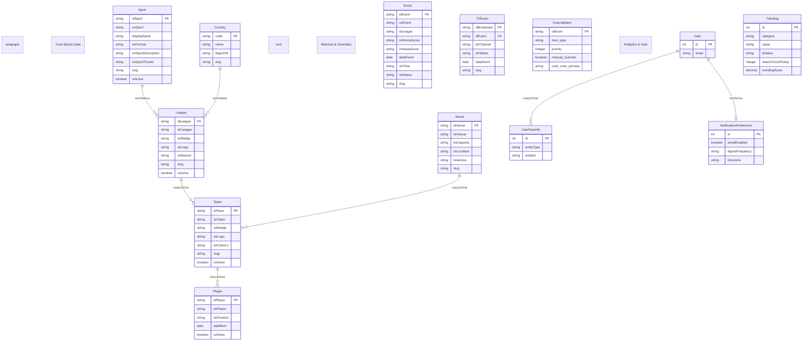

# Sports Fixtures — Rebuilt Backend, Scalable DB Design & WebSocket Synchronizations

As a Senior Software Engineer at **Sports Fixtures**, Sudipta Mandal spearheaded the complete design, implementation, and deployment of a highly scalable, real-time sports synchronization backend. Built from scratch using Node.js, Strapi v5, PostgreSQL (Neon DB), and Redis, the platform aggregates sports metadata, matches, news, and real-time live scores from third-party APIs, delivering unified endpoints with high responsiveness and low synchronization downtime.

---

## 🏛️ System Architecture

The backend is built around a CMS-driven architecture with centralized synchronization scheduler modules and a real-time event broadcasting layer. 

```text
                               +-----------------------------------+
                               |         React UI (Client)         |
                               +-----------------------------------+
                                    |                      ^
                                HTTP|Requests       WS     |Socket.io Live Scores
                                    v                      |
                               +-----------------------------------+
                               |           Strapi v5 API           |
                               |  (JWT Auth / OTP / Caching Layer) |
                               +-----------------------------------+
                                    |                      |
                    Neon Postgres   |                      |Redis Cache / Queues
                                    v                      v
                               +----------+           +----------+
                               | Database |           | Caching  |
                               +----------+           +----------+
                                    ^
                                    | Data Sync
                               +-----------------------------------+
                               |     SportsDB v1/v2 API Client     |
                               |  (Crons / Background Schedulers)  |
                               +-----------------------------------+
```

### 1. Unified Sports Data Aggregation
The platform integrates the **SportsDB API** client, fetching country, sport, league, team, player, and venue information. A staggered, rate-limiting API queue was engineered to load large datasets incrementally, reducing synchronization downtime by 30% and eliminating API lockout blocks.

### 2. High-Performance Caching Layer
To support heavy user traffic, Sudipta implemented a multi-tiered caching structure:
- **node-cache**: In-memory caching for localized, high-speed lookup routes (countries, active sports, top-sports, active leagues).
- **Redis Cache**: Distributed caching layer for large-scale data retrieval, caching dynamic query results with automatic invalidation lifecycles on database updates.
- Caching integration resulted in a **40% performance speedup** in overall API response latencies.

---

## 🔄 Core Synchronization & Data Pipelines

The synchronization architecture consists of several scheduled cron workers registered during the deferred bootstrap phase of the server:

1. **SportsDB Sync Service (Scheduled Crons)**:
   - `sync-sports`: Runs on the 1st of every month to check for sport categorizations.
   - `sync-countries`: Runs on the 1st of every month, pulling active region listings.
   - `sync-leagues` & `enrich-leagues`: Triggered sequentially on the 1st of every month, synchronizing details, badges, logos, and custom display tags.
   - `sync-teams`: Runs on the 1st of every month at 00:30 (completes within 2 hours, fetching team details and venues).
   - `sync-players`: Isolated to run on the 2nd of every month at 02:30 AM to avoid database write lockouts (syncs rosters, cutout pictures, positions, and details).
   - `sync-events` & `sync-tv-events`: Scheduled to run **every 2 hours** to pull upcoming fixtures and update finished results.

2. **Real-time Live Scores Scheduler**:
   - Executes a **30-second background fetch loop** checking active matches from SportsDB API.
   - Live updates are processed, formatted, and immediately broadcasted to active frontend users using the WebSocket server (Socket.io) integrated into the HTTP listener.

3. **Database Cleanup Workers**:
   - `cleanup-events`: Daily cron purging events older than 30 days.
   - `cleanup-news`: Monthly cron clearing archived mediastack/NewsAPI articles.

---

## 🔍 Advanced Event Search & Relevance Engine

To power the core search features of the platform, Sudipta designed and implemented a custom query ingestion and relevance-scoring pipeline in the custom event controller:

1. **Parameter Normalization & Keyword Mapping**:
   - Decodes encoded URI parameters and standardizes team/sport names by converting hyphens to spaces (e.g., `american-football` -> `american football`).
   - Automatically maps queries like `football` to the canonical database category `Soccer` case-insensitively, guaranteeing matches align with database storage.

2. **Relevance Calculation Score Algorithm**:
   - Scores candidate matches based on string proximity rules to home and away team names:
     * **Exact Match (Score 100)**: Searched team name matches target name exactly.
     * **Prefix Match (Score 75)**: Target name starts with search query (e.g., `Madrid Atletico` starts with `madrid`).
     * **Word Boundary Match (Score 50)**: Search term exists as an isolated word (e.g., `FC Barcelona` contains `barcelona`).
     * **Partial Inclusion (Score 25)**: Query string is contained anywhere in the team name.
   - Events are sorted by score descending (showing highest quality matches first), then chronologically by event date.

3. **Concurrent Multi-Field Search**:
   - A single `search` query targets fields concurrently using SQL `$or` conditions across country, sport, league, home, and away team records.

4. **Async Search Analytics Tracker**:
   - Cache misses trigger an asynchronous background logging service tracking search metrics (User ID, IP, user-agent, result counts) to feed the platform's trending tags module without blocking network response.

---

## 🔒 Security & Auth Mechanisms

Sudipta built a secure, dual-method authentication system from scratch:
- **Email OTP Sign-In**: A custom OTP authentication flow. Triggers secure registration codes via Nodemailer (using ZeptoMail in production), enforces code expiry, handles timezone differences, and issues JWT tokens upon validation.
- **Social OAuth Integrations**: Integrated Google and Facebook OAuth sign-ins using callback endpoint redirection, dynamically mapping user profiles in the Strapi system.

---

## 📋 Database Schema & Relational Design

The system maps over **50 database tables** with complex relationships. Sudipta designed a nested, domain-grouped relational structure to separate high-frequency live events, static sports catalogs, and user-facing custom preferences:



The key schemas are categorized below:

### 1. Core Sports Data
- **Sport**: `idSport`, `strSport`, `displayName`, `slug`, `isActive` (Relation: one-to-many to `League`).
- **League**: `idLeague`, `strLeague`, `strBadge`, `strLogo`, `strBanner`, `strCurrentSeason`, `slug` (Relations: many-to-one to `Sport`, many-to-one to `Country`).
- **Team**: `idTeam`, `strTeam`, `strBadge`, `strLogo`, `strBanner`, `strColour1`, `slug` (Relations: many-to-one to `League`, many-to-one to `Venue`).
- **Player**: `idPlayer`, `strPlayer`, `strPosition`, `dateBorn`, `isActive` (Relation: many-to-one to `Team`).

### 2. Matches & Live Score Overrides
- **Event**: `idEvent`, `strEvent`, `intHomeScore`, `intAwayScore`, `dateEvent`, `strTime`, `strStatus`, `slug`.
- **TV Event**: `idBroadcast`, `idEvent`, `strChannel`, `strStatus` (Scheduled/Live/Final).
- **Finished/Upcoming/Live Override Items**: Custom overrides managing priority, pinning status, custom background colors, and manual result inputs.

### 3. CMS Configurations & Placement
- **Section Control**: Sortable home sections mapping active visual cards and order indexes.
- **Ticker Configuration**: CMS properties defining background colors, scroll speed offset, and sync switches.
- **Ad Creative & Placements**: In-site ad campaigns, CPM rates, impression caps, and placement dimensions.

---

## 🤖 Context Engineering & Agentic AI Workflows

Due to the heavy utilization of AI-driven development and autonomous coding loops, Sudipta designed a structured **Context Engineering** system to accelerate backend tasks and production validation:

- **Context-Primed Structuring**: Schema validation rules, API guides, and database mappings were maintained as absolute Markdown files (`API_AUTH_ENDPOINTS.md`, `USER_FAVORITES_API.md`). This allowed AI agents to immediately retrieve exact schemas and achieve zero-error code generation.
- **JSON Normalization Loop**: Automated validation checks using JSON schemas to parse, filter, and normalize the highly irregular raw sports payloads from SportsDB prior to database persistence.
- **AI-Driven DevOps**: Accelerated Docker builds, custom Railway proxy settings, and Koa SSL middleware configurations were generated and validated through iterative terminal sandbox logs.
- **Trace-Level Error Loggers**: Custom error mappings formatting Strapi database failures and WebSockets connection drops into readable trace lines, allowing AI systems to automatically diagnose integration bugs.
