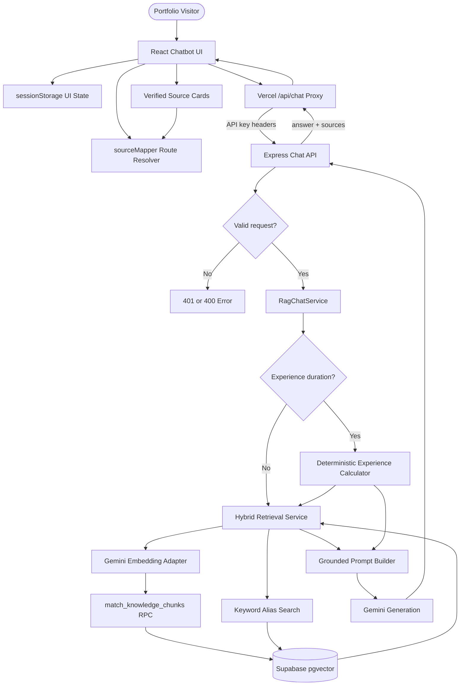
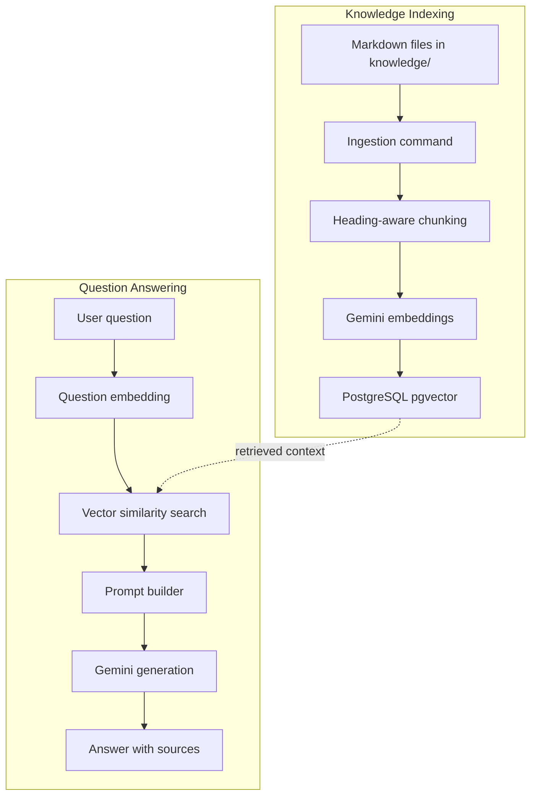
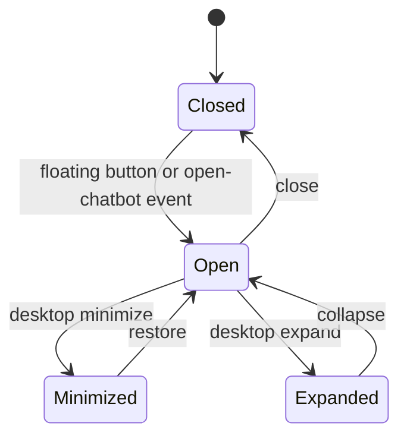
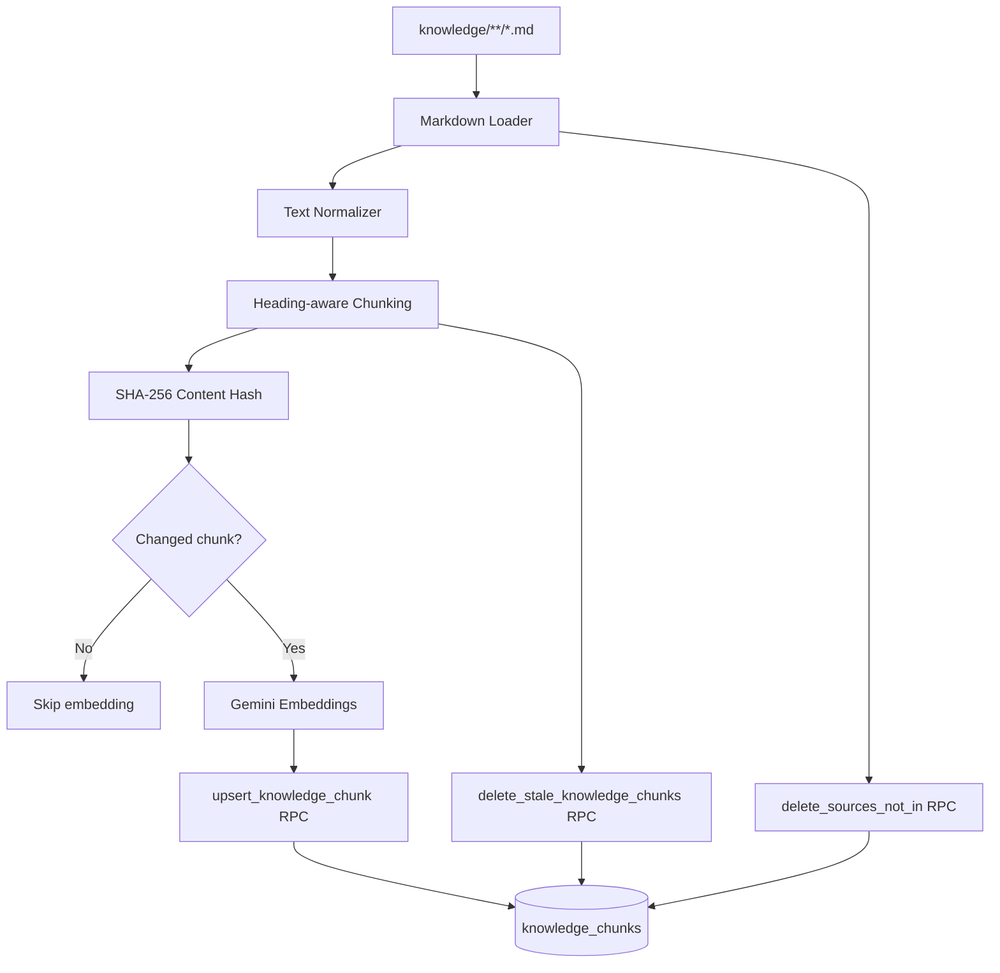
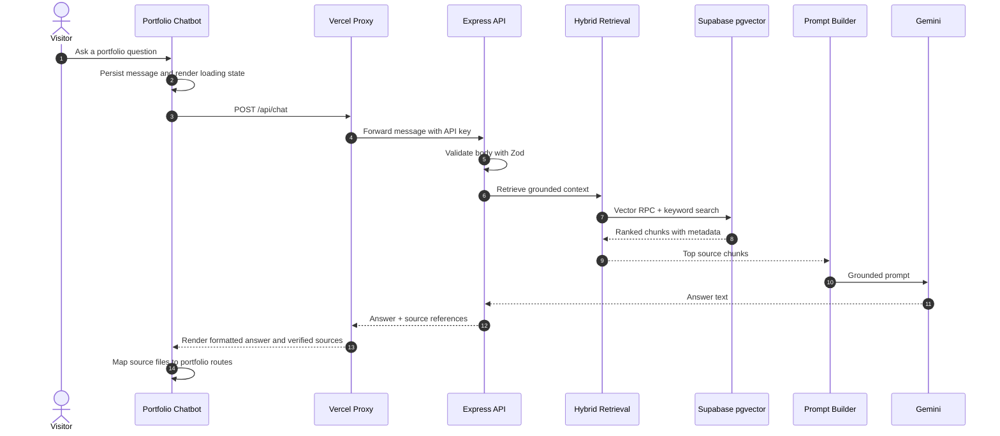
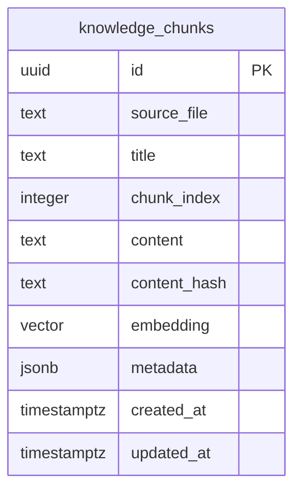
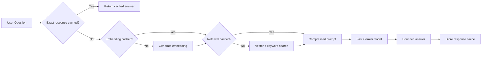
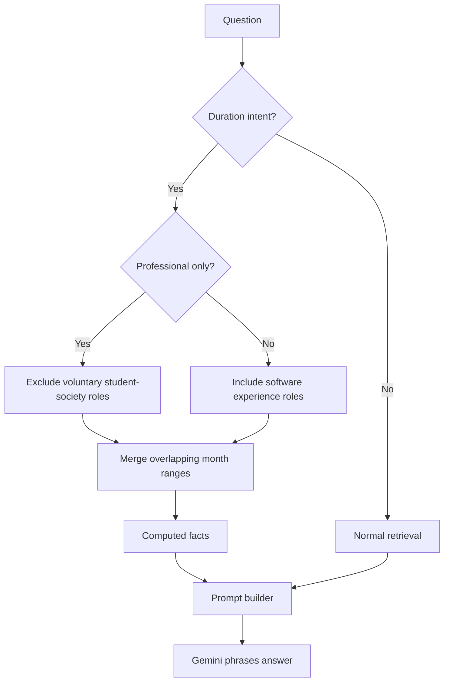

# AskSudipta - Conversational RAG Intelligence

AskSudipta is the full chat system that powers the portfolio assistant on Sudipta Mandal's website. The frontend is implemented directly in `src/components/ChatBot.jsx` with React and Material UI, while the backend is a TypeScript RAG service that turns curated markdown knowledge into searchable vector records, retrieves grounded context, and returns concise answers with source references.

The project is intentionally framework-light: React, Material UI, React Router, Node.js, Express, TypeScript, Supabase PostgreSQL with pgvector, Gemini embeddings and generation, Zod validation, and Vitest coverage.

---

## System Architecture



Chat requests do not read markdown files directly. The runtime source of truth is the Supabase `knowledge_chunks` table populated by ingestion.

---

## RAG Flow

This is the core two-lane flow from authored knowledge to grounded answers:



The detail page implements this as an interactive section with clickable nodes for each indexing and answering step.

---

## Frontend Chat Experience

The assistant frontend lives in `src/components/ChatBot.jsx` and is part of the AskSudipta project surface, not a separate demo shell.



Frontend responsibilities:

- Manages closed, open, minimized, expanded, and mobile full-height layouts.
- Persists `chat_window_state`, `chat_history`, `chat_is_expanded`, and `hide_chat_hint` in `sessionStorage`.
- Provides suggested questions for first-time chat sessions.
- Sends messages to the same-origin `/api/chat` proxy.
- Formats assistant responses with headings, bullets, bold text, links, and knowledge-source paths.
- Displays verified source cards with match percentages.
- Uses `sourceMapper` to route citations to project detail pages, experience pages, research pages, home-section anchors, or the resume modal.

---

## Knowledge Ingestion Flow



Important ingestion decisions:

- Markdown is scanned recursively from the configured `KNOWLEDGE_DIR`.
- Chunks preserve title, heading, heading path, chunk index, and token estimate metadata.
- Chunks target roughly 300-600 tokens.
- Embeddings use the configured Gemini embedding model and 768 output dimensions by default.
- Existing chunks are updated only when content hash, title, or metadata changes.

---

## Chat Answer Flow



The chat response shape includes an `answer` string and `sources` array with source file, title, chunk index, and similarity.

---

## Vector Store Schema



Core database behavior:

- `knowledge_chunks.source_file + chunk_index` is unique.
- `embedding` is stored as `vector(768)`.
- `match_knowledge_chunks` orders by cosine distance and returns similarity.
- `ivfflat.probes` is set to `100` inside the RPC so small corpora do not return empty nearest-list results.
- Keyword search runs against `source_file`, `title`, and `content`, then merges with vector results.

---

## Latency Strategy



Defaults favor fast portfolio Q&A:

- Fast generation model through `GEMINI_FAST_GENERATION_MODEL`.
- `CHAT_MAX_OUTPUT_TOKENS` capped at 350 by default.
- `CHAT_TEMPERATURE` set low for direct factual answers.
- `CHAT_THINKING_BUDGET=0` by default.
- `CHAT_CONTEXT_TOP_K` and `CHAT_CONTEXT_MAX_CHARS_PER_CHUNK` bound prompt size.
- Process-local caches cover embeddings, retrieval results, and exact repeated chat responses.

---

## Experience Duration Calculation



The LLM phrases the final response, but it does not calculate date ranges. Typed role data and deterministic month merging produce the authoritative duration.

---

## Public API

```http
POST /api/chat
Content-Type: application/json
x-api-key: <CHAT_API_KEY>
```

```json
{
  "message": "Tell me about ValoDash."
}
```

```json
{
  "answer": "...",
  "sources": [
    {
      "sourceFile": "knowledge/projects/valodash.md",
      "title": "ValoDash",
      "chunkIndex": 0,
      "similarity": 0.91
    }
  ]
}
```

The portfolio frontend calls its same-origin Vercel proxy, and the proxy forwards the message to this protected backend with API credentials.
