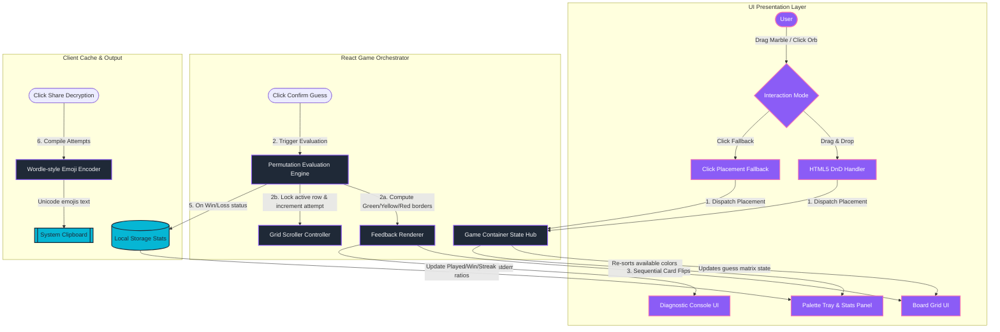
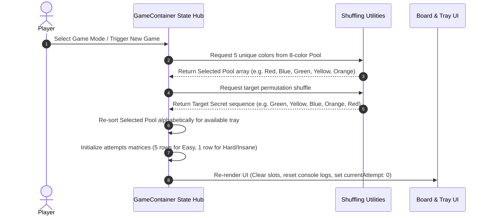
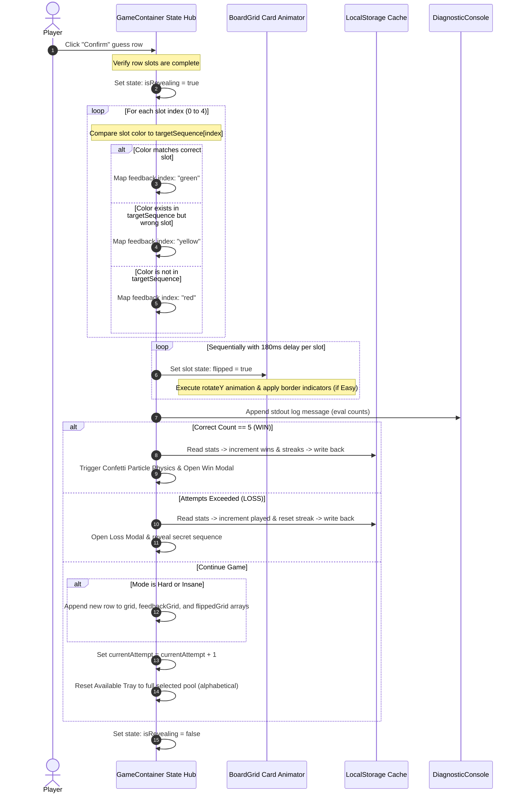

# Color Cuddle — Interactive Game & UI State Architecture

Color Cuddle is an immersive, high-fidelity color permutation deduction game built on React and Next.js. Players arrange, drag, and decode a hidden sequence of 5 unique glowing color marbles using diagnostic feedback clues.

This document outlines the **architectural blueprint, state interaction loops, component hierarchy, and local storage schema** of the Color Cuddle application.

---

## 🏛️ Client-Side Architecture & Workflow

Color Cuddle runs entirely client-side, using React's interactive states, modern HTML5 Drag & Drop APIs, and browser `localStorage` to deliver low-latency gameplay without server Round-Trip Time (RTT) delays.

### 1. High-Level Game Loop Workflow

This flowchart illustrates the interaction pathways from user input events to grid updates, feedback calculations, local storage writes, and share parsers:



---

### 2. Component Roles

1. **Central State Orchestrator (`GameContainer.js`)**:
   - Manages core reactive states: active `difficulty`, secret `targetSequence`, active `grid` matrix guesses, evaluations/clues `feedbackGrid`, active `currentAttempt`, console stdout `history`, and `gameStatus`.
   - Handles hybrid device compatibility by hosting state change handlers for both HTML5 DnD dragging and touchscreen tap events.
   - Triggers victory celebrations (confetti particle physics on canvas) and updates persistent statistics.

2. **Attempts Grid Board (`BoardGrid.js`)**:
   - Renders row blocks representing guesses (slowing viewport overflow via automatic scrolling to the active row).
   - Coordinates individual marble slots supporting click-to-remove triggers and drop-targets.
   - Animates card flip transitions using 3D perspective CSS transforms (`rotateY`).
   - Implements difficulty visual overrides (neutral flips on Hard, hidden padlock masking on Insane).

3. **Diagnostic STDOUT Console (`DiagnosticConsole.js`)**:
   - Emulates a server-side terminal prompt, rendering diagnostic logs for guesses.
   - Restricts scrolls to local console containers via auto-scrolling refs, preventing screen jitter on mobile layouts.

4. **Palette Tray & Local Stats Panel (`PaletteTray.js`)**:
   - Groups remaining available color options, sorting them alphabetically by name to avoid placement bias.
   - Houses the statistics drawer displaying game wins, play counts, and streaks read from browser cache.

5. **Slide Tutorial Modal (`TutorialModal.js`)**:
   - Dynamically details difficulty criteria (Easy, Hard, Insane rules) using responsive sliders and visual color block highlights.

---

## 🔄 Core Interactive Workflows

### 1. Game Initialization Workflow
Initializes target color permutations and structures grid layouts.



### 2. Guess Submission & Feedback Evaluation Flow
Evaluates player placements, triggers sequential animations, and logs diagnostic indices.



### 3. Wordle-Style Sharing Log Workflow
Encodes attempts into difficulty-adapted clipboard copy logs.

- **Easy Mode**: Employs colored grid blocks (🟩, 🟨, 🟥) summarizing visual boards.
- **Hard Mode**: Outputs numeric logs tracking absolute correct and misplaced indices.
- **Insane Mode**: Prefixes numeric logs with locked padlocks (🔒) to represent visual masking.

```text
// Share Output Formats:

Easy Mode:                             Hard Mode:                            Insane Mode:
🎨 Color Cuddle (Easy) - 2/5 Attempts  🎨 Color Cuddle (Hard) - 3 Attempts   🎨 Color Cuddle (Insane) - 4 Attempts
🟩🟨🟥🟥🟨                             Attempt 1: [1 🟢, 2 🟡]              Attempt 1: 🔒 [0 🟢, 2 🟡]
🟩🟩🟩🟩🟩                             Attempt 2: [2 🟢, 1 🟡]              Attempt 2: 🔒 [1 🟢, 1 🟡]
                                       Attempt 3: [5 🟢, 0 🟡] (SUCCESS 🧠) Attempt 3: 🔒 [2 🟢, 3 🟡]
                                                                             Attempt 4: 🔒 [5 🟢, 0 🟡] (SOLVED 🧠)
```

---

## 🗄️ Local Storage & Client State Schema

Color Cuddle operates with local storage objects to preserve scoring statistics across sessions.

### 1. Local Storage Schema

All difficulty metrics are cached under a unified storage key:

| Key | Format | Type | Description |
| :--- | :--- | :--- | :--- |
| `color-cuddle-stats-v2` | JSON | Object | Stores play counts, total wins, and streak counters per difficulty level. |

#### JSON Structure representation:
```json
{
  "easy": {
    "played": 27,
    "wins": 24,
    "currentStreak": 5
  },
  "hard": {
    "played": 14,
    "wins": 10,
    "currentStreak": 2
  },
  "insane": {
    "played": 8,
    "wins": 4,
    "currentStreak": 1
  }
}
```

---

### 2. State Lifecycle Map

The primary state engine is structured with the following values:

```text
+-------------------------------------------------------------------------+
|                              GameContainer                              |
+-------------------------------------------------------------------------+
       |                                                              
       +---> difficulty       : 'easy' | 'hard' | 'insane' (active mode)
       +---> maxAttempts      : 5 | 120 (max attempts limit)
       +---> selectedColors   : Array<{ id, name, hex, bgClass }> (active pool)
       +---> targetSequence   : Array<{ id, name, hex, bgClass }> (secret key)
       +---> availableColors  : Array<{ id, name, hex, bgClass }> (unused colors)
       |
       +---> grid             : Array<Array<Color | null>> (guess rows)
       +---> feedbackGrid     : Array<Array<'green'|'yellow'|'red'|'neutral'|'locked'|'none'>>
       +---> flippedGrid      : Array<Array<Boolean>> (revealed flags)
       |
       +---> currentAttempt   : Integer (active guess row index)
       +---> history          : Array<String> (diagnostic stdout log strings)
       +---> gameStatus       : 'playing' | 'won' | 'lost' (game loop states)
       +---> isRevealing      : Boolean (locks inputs during card-flip animations)
       +---> stats            : Stats Object (cached played, wins, and streaks)
```
