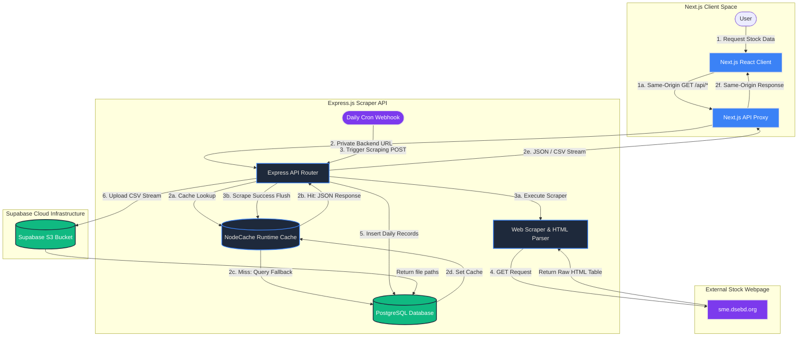
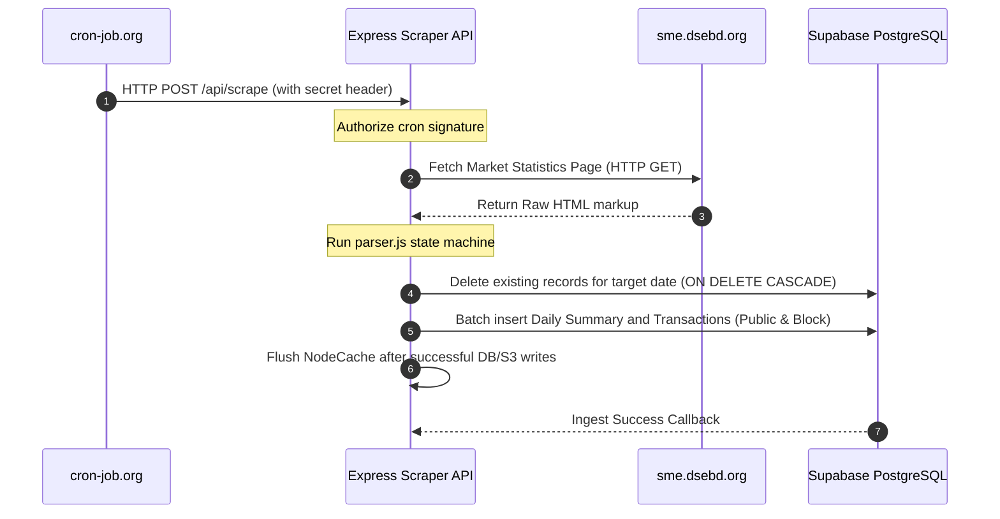
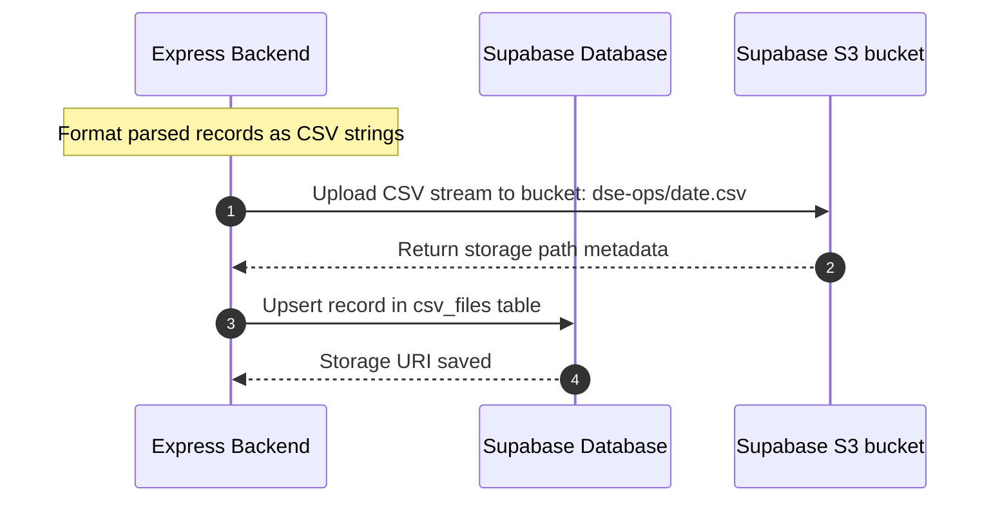
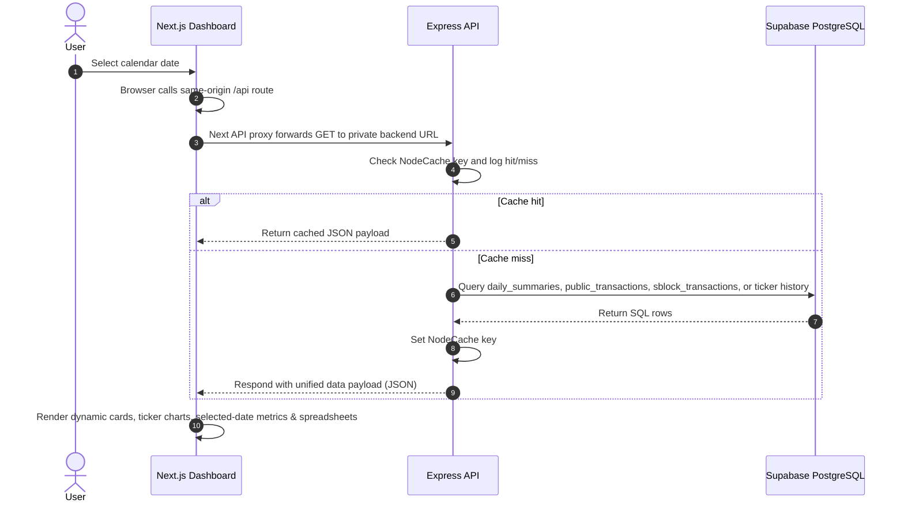
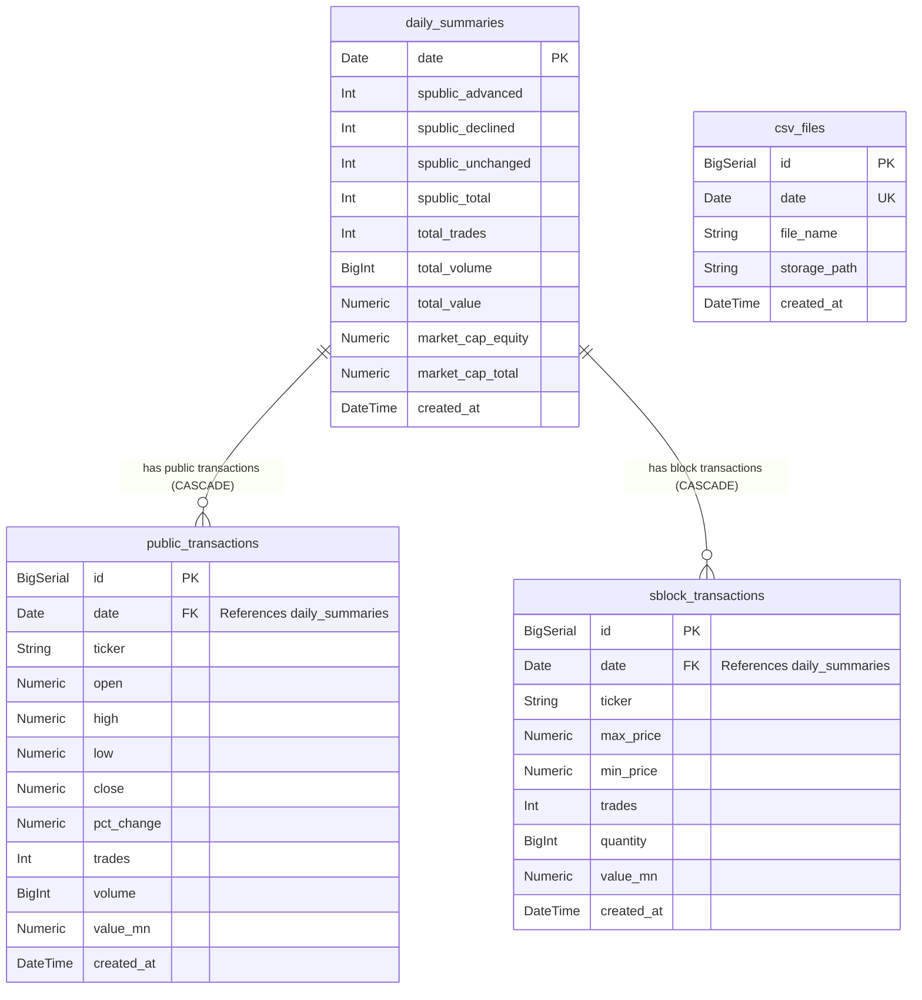

# DSE Ops — Architectural System Design

DSE Ops is a high-performance market archiving and visual analytics platform built to scrape, index, and query daily market telemetry and block transactions from the Dhaka Stock Exchange (DSE) SME board.

This document outlines the **architectural blueprint, data flows, core workflows, and relational database schema** of the DSE Ops application.

---

## 🏛️ System Architecture & Workflow

DSE Ops uses a decoupled, full-stack monorepo system containing a scraping Node.js/Express service, an in-process NodeCache read layer, a relational Supabase PostgreSQL database, a Supabase Storage bucket, and a modern Next.js client interface protected by same-origin API proxy routes.

### 1. High-Level Process Workflow

This flowchart outlines the coordinate data pathways between external sources, automated triggers, server compute layers, database storage, and client views:



---

### 2. Component Roles

1. **Client Portal (Next.js / TypeScript)**:
   - Built with Next.js App Router, with structural layouts styled using pure custom CSS Modules.
   - Provides users with interactive date filters, calendar tools, ticker-history drilldowns, and multi-metric chart inspection.
   - Renders performance metrics, public listings, block transaction spreadsheets, range analytics, selected-date point details, and overlapping chart series.
   - Calls same-origin Next.js API routes so backend URLs and cron secrets are not bundled into browser JavaScript.

2. **Next.js API Proxy Layer**:
   - Accepts safe public GET requests from the browser and forwards them server-side to the private Express backend URL.
   - Preserves JSON responses, CSV download streams, content-disposition headers, and cache-control headers.
   - Blocks public scrape mutation routes so scraping remains a backend/cron-only operation.

3. **Express.js API Server (Node.js)**:
   - Houses endpoints for fetching transaction archives, lists of downloadable CSV reports, and daily market dashboards.
   - Securely listens for daily End-of-Day scraping triggers, validating authorization secrets using headers.
   - Orchestrates automated data pipelines: scraping, parsing, writing to the database, converting to CSV, and uploading to storage.

4. **NodeCache Runtime Cache**:
   - Caches JSON read responses for market data, ticker history, latest CSVs, and paginated CSV lists.
   - Emits terminal logs for cache hit, miss, set, and flush events.
   - Flushes after a successful cron scrape so the next read repopulates fresh data.

5. **Scraper & Parser Engine (`parser.js`)**:
   - Fetches target HTML dynamically from `sme.dsebd.org/sme_market-statistics.php`.
   - Utilizes `node-html-parser` to navigate raw DOM trees and extract pre-formatted text segments.
   - Employs regex-driven parsers and state machines to isolate:
     - Today's date and summary statistics (Total Trades, Volume, Value, Market Cap).
     - Public Transactions Table (Open, High, Low, Close, percentage adjustments, trades, volume).
     - Block Transactions Table (Max Price, Min Price, trades, quantity, Value in Millions).

6. **Supabase PostgreSQL & S3 Storage**:
   - Houses the relational tables caching transactions and summaries, structured to delete older records first (cascading deletes) before re-inserting to ensure idempotency.
   - Acts as the primary store for raw daily backups, generating and serving direct CSV downloads.

---

## 🔄 Core Workflows

### 1. Daily End-of-Day Scraping Loop (Cron Triggered)


### 2. CSV Archival & Upload Pipeline


### 3. Client Query & Analytics Pipeline


---

## 🗄️ Database Design

The schema is hosted on Supabase PostgreSQL and handles raw transaction data structures with cascading deletes to maintain data purity.

### 1. High-Level Relational Structure

```text
       +--------------------+
       |   daily_summaries  |
       +---------+----------+
                 | 1
                 |
                 | 1..N (Cascading Deletes)
                 v
       +---------+----------+
       | public_transactions|
       +--------------------+
       
                 | 1
                 |
                 | 1..N (Cascading Deletes)
                 v
       +---------+----------+
       | sblock_transactions|
       +--------------------+

       +--------------------+
       |      csv_files     | (Independent files ledger)
       +--------------------+
```

---

### 2. Entity-Relationship Schema Map



---

### 3. Relationship & Integrity Constraints

| Relation | Foreign Key | Cardinality | Cascading Rule | Description |
| :--- | :--- | :--- | :--- | :--- |
| **daily_summaries → public_transactions** | `public_transactions.date` | `1 : N` | `ON DELETE CASCADE` | Deleting a summary for a specific date clears all associated public transaction logs instantly. |
| **daily_summaries → sblock_transactions** | `sblock_transactions.date` | `1 : N` | `ON DELETE CASCADE` | Deleting a summary for a specific date clears all block transaction records instantly. |
| **csv_files** | None | `1 : 0..1` | N/A | Tracks generated file names and Supabase storage paths mapped per unique trading date. |
