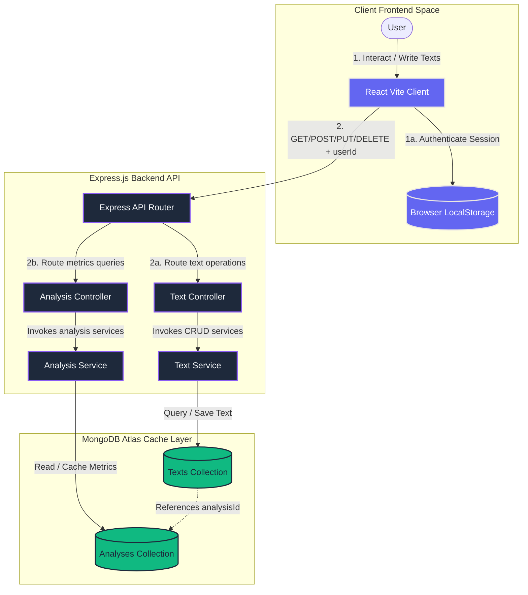
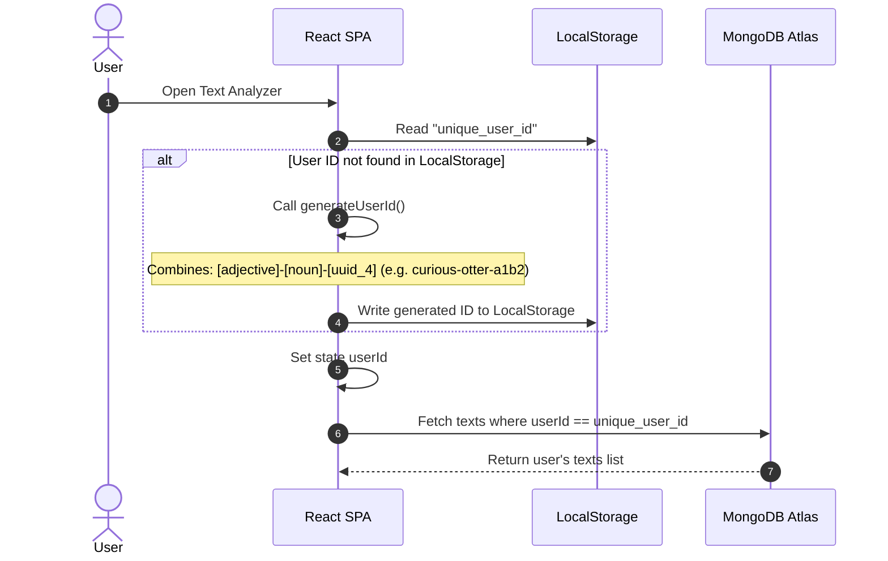
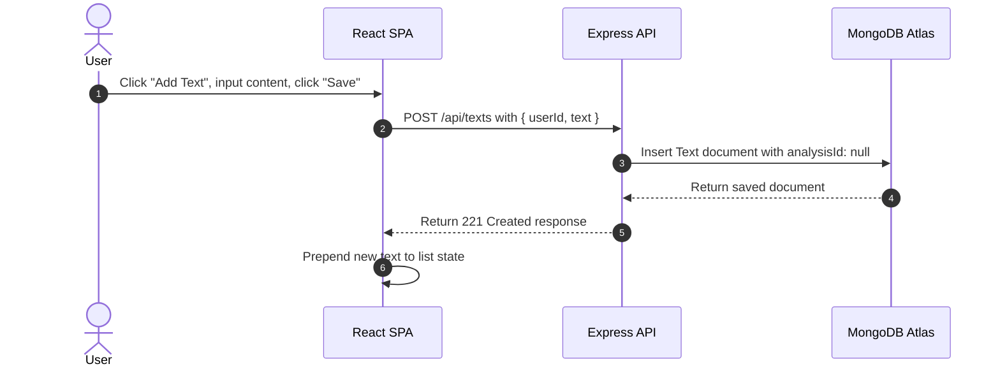
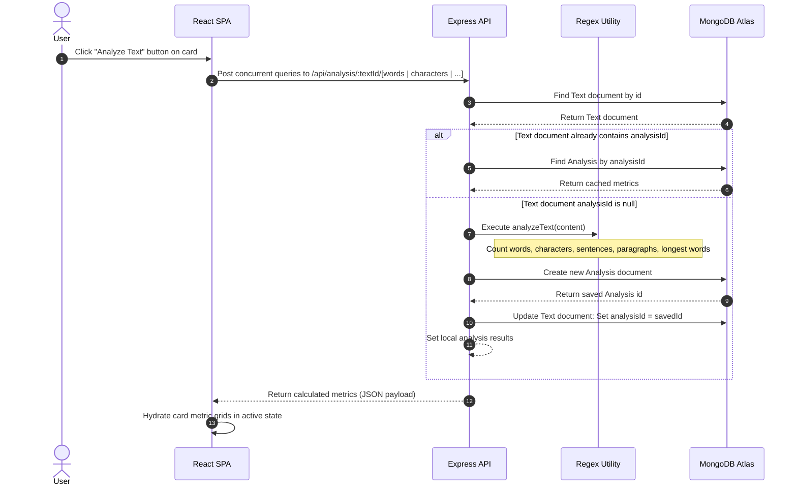
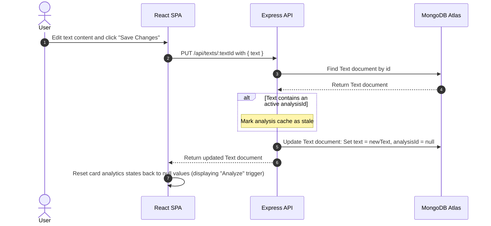

# Text Analyzer — Architectural System Design

Text Analyzer is an online developer utility and lexical analysis engine. It provides real-time counts (words, characters, sentences, paragraphs, and longest word per paragraph), custom text formatting utilities, and a syntax-highlighted JSON viewer. 

This document details the **architectural blueprint, component data workflows, mathematical formulas, and database schema** powering the Text Analyzer application.

---

## 🏛️ System Architecture & Workflow

Text Analyzer is built using a client-server architecture with React on the frontend, Express on the backend, and MongoDB Atlas for document storage. It employs an on-demand calculation and caching strategy for analysis results to optimize database storage and performance.

### 1. High-Level Process Workflow

This flowchart outlines the interaction pathways between the frontend application, the backend API controllers, and the database storage layers:



---

### 2. Component Roles

1. **Client Frontend (React / Vite)**:
   - Structured as a single-page workspace utilizing Material UI for styling and layouts.
   - Manages tabs for text metrics ("Analyzer"), clean text mutation filters ("Formatter"), and raw output schema parsing ("JSON Viewer").
   - Identifies individual browsers locally via an anonymous user generator (`getOrCreateUserId`) saved to `localStorage` to support private sandboxes without requiring password logins.
   - Issues asynchronous fetch calls to backend endpoints to synchronize dashboard metrics.

2. **Express.js API Server (TypeScript)**:
   - Implements RESTful routes categorized into text actions (`/api/texts`) and analytics metrics (`/api/analysis`).
   - Standardizes error logging, parses incoming JSON payloads, and handles Cross-Origin Resource Sharing (CORS) configurations.
   - Delegates business rules to specialized service functions to maintain modularity.

3. **MongoDB Atlas (Mongoose)**:
   - Stores raw text items and calculated analytics as documents in separate collections.
   - Employs schema models enforcing property types, validation, and automated execution timestamps.

---

## 🔄 Core Workflows

### 1. User Session Initialization (Anonymous Sandbox)
To avoid login forms, the application assigns a unique user string to each browser.



---

### 2. Text Creation Workflow
Saves raw inputs to the database while initializing analysis properties as null.



---

### 3. Lexical Analysis Execution & Hydration Flow
Calculates linguistic metrics on-demand when the user clicks the "Analyze Text" button.



---

### 4. Text Mutation & Cache Invalidation
When text content is modified, precomputed analysis records become obsolete and must be cleared.



---

## 📊 Lexical Analysis Engine

Linguistic metrics are processed inside `backend/src/utils/analyzer.ts` using regular expression matching and text delimiters:

### 1. Calculation Mechanics

- **Word Count**:
  The string is lower-cased and scanned for word boundaries containing word characters:
  $$\text{Regex Pattern} = \text{/}\backslash\text{b}\backslash\text{w}+\backslash\text{b/g}$$

- **Character Count (Excluding Spaces)**:
  All whitespaces (tabs, spaces, newlines) are stripped before measuring string length:
  $$\text{Regex Pattern} = \text{/}\backslash\text{s+/g}$$

- **Sentence Count**:
  Splits text using punctuation markers (`.`, `!`, `?`) followed by optional spacing:
  $$\text{Regex Pattern} = \text{/[.!?]}\backslash\text{s*/}$$

- **Paragraph Count**:
  Splits text using consecutive newline occurrences as dividers:
  $$\text{Regex Pattern} = \text{/}\backslash\text{n+/}$$

- **Longest Word per Paragraph**:
  Segmented paragraphs are matched for individual words, then iterated using a reducer to locate the element with the maximum character length:
  $$\text{Longest Word} = \text{words.reduce}((a, b) \Rightarrow (b.\text{length} > a.\text{length} ? b : a), \text{""})$$

---

## 🗄️ Database Design

The database uses MongoDB Atlas managed via Mongoose schemas.

### 1. Relational Map

```text
    +--------------------------------+           1 : 0..1
    |              Text              |-----------------------+
    +--------------------------------+                       |
    | _id: ObjectId [PK]             |                       |
    | userId: String                 |                       |
    | text: String                   |                       |
    | analysisId: ObjectId [FK, null]|                       |
    | createdAt: DateTime            |                       |
    | updatedAt: DateTime            |                       |
    +--------------------------------+                       |
                                                             |
                                                             v
                                             +--------------------------------+
                                             |            Analysis            |
                                             +--------------------------------+
                                             | _id: ObjectId [PK]             |
                                             | textId: ObjectId [FK]          |
                                             | wordCount: Number              |
                                             | charCount: Number              |
                                             | sentenceCount: Number          |
                                             | paragraphCount: Number         |
                                             | longestWords: Array[String]    |
                                             | createdAt: DateTime            |
                                             | updatedAt: DateTime            |
                                             +--------------------------------+
```

---

### 2. Schema Entities

#### Text Schema
Represents raw text entries posted by users:

```typescript
const textSchema = new mongoose.Schema(
  {
    userId: {
      type: String,
      required: true,
    },
    text: {
      type: String,
      required: true,
    },
    analysisId: {
      type: mongoose.Schema.Types.ObjectId,
      ref: "Analysis",
      default: null,
    },
  },
  { timestamps: true }
);
```

#### Analysis Schema
Represents computed metrics cached for a specific text document:

```typescript
const analysisSchema = new mongoose.Schema(
  {
    textId: {
      type: mongoose.Schema.Types.ObjectId,
      ref: "Text",
      required: true,
    },
    wordCount: {
      type: Number,
      required: true,
    },
    charCount: {
      type: Number,
      required: true,
    },
    sentenceCount: {
      type: Number,
      required: true,
    },
    paragraphCount: {
      type: Number,
      required: true,
    },
    longestWords: {
      type: [String],
      required: true,
    },
  },
  { timestamps: true }
);
```
