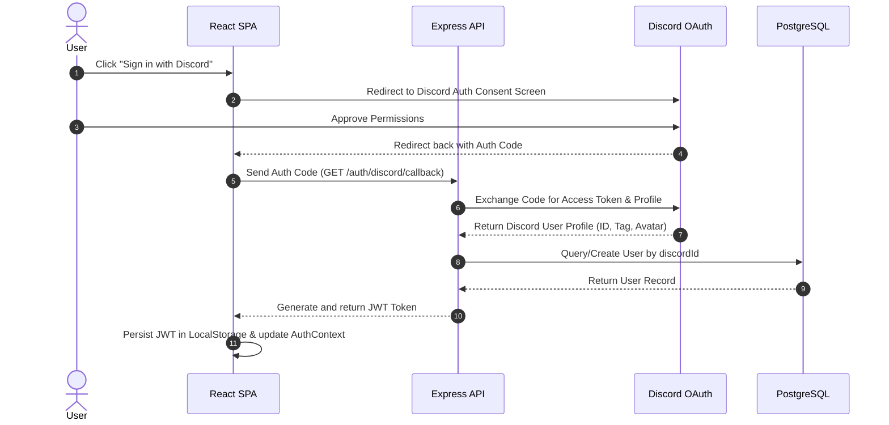
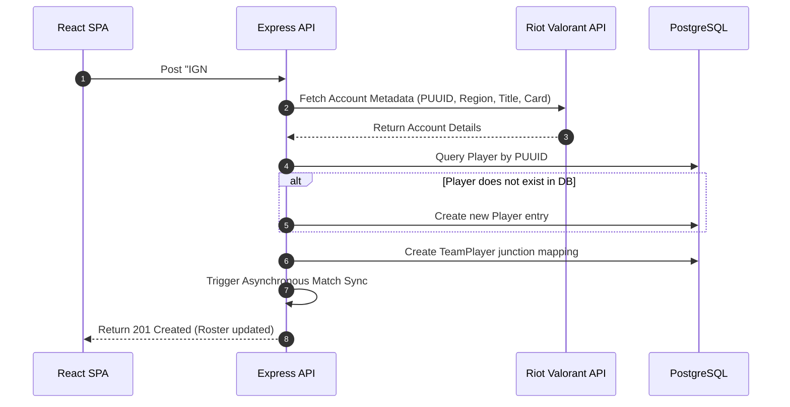
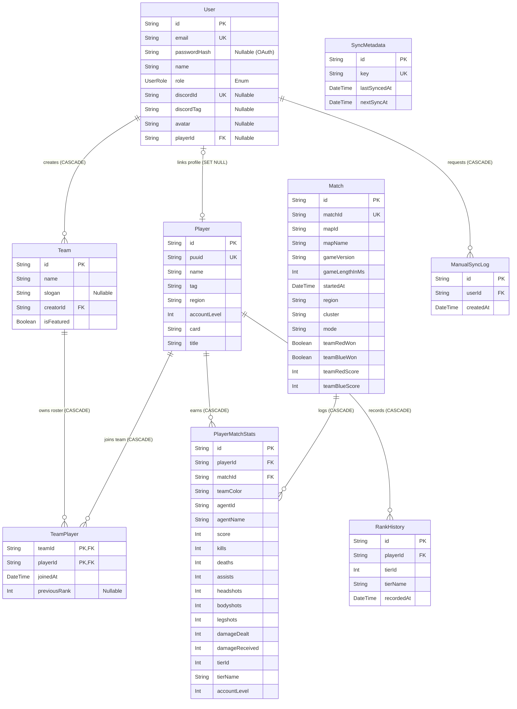

# ValoDash — Architectural System Design

ValoDash is a premium, high-fidelity team dashboard and competitive ranking leaderboard for Valorant. It enables competitive groups to aggregate player telemetry, monitor match records, calculate custom performance highlights, and track competitive rank progression across seasons.

This document outlines the **architectural blueprint, system design concepts, data workflows, and database schema** of the ValoDash application.

---

## 🏛️ System Architecture & Workflow

ValoDash is built on a decoupled, cache-centric Client-Server architecture designed to resolve API rate limitations and deliver sub-second data query response times.

### 1. High-Level Process Workflow

This flowchart outlines how request routing, cache verification, and scheduled background workers coordinate data flow:

```mermaid
flowchart TD
    %% Define Nodes
    subgraph ClientSpace [Client Frontend Space]
        User([User]) -->|1. Interact / Query Stats| Client[Next.js React Client]
        Client -->|1a. Authenticate| DiscordGate[Discord OAuth Portal]
    end

    subgraph GatewayCompute [Express.js Backend API]
        Client -->|2. GET/POST Requests + JWT| Router[Express API Router]
        Router -->|2a. Zod & JWT validation| AuthGuard{Auth Valid?}
        
        AuthGuard -->|No| Reject[401 Unauthorized]
        AuthGuard -->|Yes| CacheCheck{Is data in local DB?}
        
        CacheCheck -->|Yes| FetchCache[Query Postgres Cache]
        CacheCheck -->|No| StaggerSync[Execute Staggered Sync]
    end

    subgraph CacheStore [ PostgreSQL Cache Layer ]
        FetchCache --> DB[(PostgreSQL Database)]
        DB -->|Return cached metrics| Router
    end

    subgraph ExternalAPI [External Integrations]
        DiscordGate -->|Auth Callback| DiscordAPI[Discord Auth API]
        DiscordAPI -->|Return profile & credentials| Router
        StaggerSync -->|Staggered HTTP calls (2000ms delay)| RiotAPI[Riot Valorant API]
    end

    subgraph ScheduledWorker [GitHub Actions Scheduled Sync]
        GitHub[GitHub Actions Runner] -->|3. Cron Trigger Webhook (Every 12h)| Router
        Router -->|3a. Start Async Sync Thread| StaggerSync
        RiotAPI -->|Inbound Telemetry| Ingestion[Match Ingestion Parser]
        Ingestion -->|3b. Compute Averages & Rank Deltas| DB
    end

    %% Node Styling
    classDef client fill:#ff4655,stroke:#ece8e1,stroke-width:2px,color:#fff;
    classDef server fill:#17222d,stroke:#ff4655,stroke-width:2px,color:#ece8e1;
    classDef db fill:#00f5a0,stroke:#17222d,stroke-width:2px,color:#17222d;
    classDef ext fill:#76807c,stroke:#ece8e1,stroke-width:2px,color:#fff;
    
    class Client,DiscordGate client;
    class Router,AuthGuard,CacheCheck,Ingestion,Reject server;
    class DB db;
    class DiscordAPI,RiotAPI,GitHub,StaggerSync ext;
```

---

### 2. Component Roles

1. **Client Frontend (React / Next.js)**:
   - Built with Next.js App Router, styling is handled through Vanilla CSS Modules.
   - Manages authorization and active configurations via unified client contexts (`AuthContext` and `TeamContext`).
   - Requests telemetry metrics, custom MVPs, Aim Kings, and competitive progression charts.

2. **Express.js API Server (TypeScript)**:
   - Orchestrates JWT token verification, checks user access scopes (`USER` vs `SUPERADMIN`), and enforces schema runtime safety with Zod validation.
   - Computes statistical averages (K/D, ACS, headshot % accuracy) and runs the leaderboard sorting algorithms on-the-fly from PostgreSQL data.

3. **PostgreSQL Cache (Prisma)**:
   - Houses user sessions, custom team configurations, historical match details, and rank-fluctuation histories.
   - Isolates players per-team so players can exist across multiple rosters without data leaking.

4. **Scheduled Sync Worker (GitHub Actions Webhook)**:
   - Triggers background match refreshes asynchronously via automated workflows running every 12 hours.
   - Cycles through registered player targets, executing requests staggered with a `2000ms` delay to conform to external API rate limits.

---

## 🔄 Core Workflows

### 1. User Authentication Flow (Discord OAuth2)


### 2. Player Enrollment Workflow
When a user adds a player to their roster, the system links the player metadata and schedules an initial sync.
- **Roster Bounds**: Enforces a maximum team size limit of `10` players, and users can create up to `2` teams.
- **Player Isolation**: Players are scoped per-team, allowing the same in-game tag to exist across multiple rosters in complete isolation.



### 3. Asynchronous Match Synchronization Engine
To bypass Riot API rate limits, ValoDash uses a scheduled pull mechanism.
- **Scheduling**: A GitHub Actions workflow runs a Cron job (every 12 hours) that triggers a secure webhook endpoint (`POST /api/sync/trigger`) with an authorization secret header.
- **Staggering**: The sync worker loops through all registered players globally, enforcing a `2000ms` staggered delay between HTTP requests to respect external API rate limits.
- **Ingestion Pipeline**:
  1. Retrieve competitive match history from Riot API.
  2. Parse matches: If the external `matchId` is new, create a `Match` record and compute team scores.
  3. Map matches to active database players (matching `puuid` fields).
  4. Compute `PlayerMatchStats` (K/D ratio, headshot accuracy, damage dealt, tier name) and write them to the DB.
  5. Check if the player's competitive rank changed, and log the delta in the `RankHistory` table.

---

## 📊 Analytics & Ranking Engine

Rather than querying external sources on every load, ValoDash aggregates performance metrics directly in PostgreSQL.

### 1. Performance Formulae
- **Kill/Death Ratio (K/D)**:
  $$\text{KD} = \frac{\sum \text{Kills}}{\max(1, \sum \text{Deaths})}$$
- **Average Combat Score (ACS)**:
  $$\text{ACS} = \frac{\sum \text{Match Scores}}{\text{Total Matches Tracked}}$$
- **Headshot Accuracy (HS%)**:
  $$\text{HS\%} = \frac{\sum \text{Headshots}}{\sum (\text{Headshots} + \text{Bodyshots} + \text{Legshots})} \times 100$$
- **Win Rate**:
  $$\text{Win Rate} = \frac{\text{Matches Won}}{\text{Total Matches Tracked}} \times 100$$

### 2. Team Highlights Calculation
- **Team MVP**: The roster member with the highest calculated Average Combat Score (ACS) over their last 10 tracked competitive records.
- **Aimbot King**: The roster member with the highest calculated Headshot Accuracy Percentage (HS%).

### 3. Custom Leaderboard Sorting Algorithm
Players on a team leaderboard are ranked using three hierarchical criteria:
1. **Competitive Tier (Primary)**: Mapped as an integer index (e.g., Gold 1 = 12, Diamond 1 = 18, Radiant = 27).
2. **ACS (Secondary)**: Average combat score over active records.
3. **K/D Ratio (Tertiary)**: Historical K/D ratio.

---

## 🗄️ Database Design

The database schema is managed via PostgreSQL and structured through Prisma ORM. It caches third-party API payloads to guarantee sub-second frontend queries and enforces strict referential integrity.

### 1. High-Level Relational Structure

This graphical schema maps table cardinality, primary keys, and foreign key relations:

```text
                     +------------------+
                     |   SyncMetadata   | (Independent Cron log)
                     +------------------+
                               
   +------------------+    1 : N    +------------------+
   |  ManualSyncLog   |<------------|       User       |
   +------------------+             +--------+---------+
                                             | 1
                                             |
                                             | 0..1 (links profile)
                                             v
   +------------------+    1 : N    +------------------+
   |       Team       |<------------|      Player      |
   +--------+---------+             +---+--------+-----+
            | 1                         |        |
            |                           | 1      | 1
            | 1..N (members)            |        |
            v                           v        v N
   +------------------+    N : 1        |    +---+--------------+
   |    TeamPlayer    |-----------------+    |   RankHistory    |
   +------------------+                      +------------------+
                                                 | N
                                                 |
                                                 | 1..N
                                                 v
   +------------------+    1 : N    +------------+-----+
   |      Match       |<-----------| PlayerMatchStats |
   +------------------+             +------------------+
```

---

### 2. Entity-Relationship Schema Map



---

### 3. Relationship & Integrity Constraints

| Relation | Foreign Key | Cardinality | Cascading Rule | Description |
| :--- | :--- | :--- | :--- | :--- |
| **User → Player** | `User.playerId` | `1 : 0..1` | `ON DELETE SET NULL` | Links an authenticated user to a single Valorant player profile. Removing the player does not delete the user account. |
| **User → Team** | `Team.creatorId` | `1 : N` | `ON DELETE CASCADE` | Associates teams with their owners. Standard users can create up to `2` teams. Deleting a user purges all owned teams. |
| **User → ManualSyncLog** | `ManualSyncLog.userId` | `1 : N` | `ON DELETE CASCADE` | Logs rate-limiting quotas for manual synchronizations triggered by users. |
| **Team → TeamPlayer** | `TeamPlayer.teamId` | `1 : N` | `ON DELETE CASCADE` | Maps team memberships. Deleting a team purges all association records. |
| **Player → TeamPlayer** | `TeamPlayer.playerId` | `1 : N` | `ON DELETE CASCADE` | Isolates players on rosters (maximum `10` players per team). Players can exist across multiple teams. |
| **Player → PlayerMatchStats**| `PlayerMatchStats.playerId` | `1 : N` | `ON DELETE CASCADE` | Relates match-by-match metrics to players. Deleting a player removes all telemetry. |
| **Match → PlayerMatchStats** | `PlayerMatchStats.matchId` | `1 : N` | `ON DELETE CASCADE` | Maps match metadata to player statistics. Deleting a match clears associated stats. |
| **Player → RankHistory** | `RankHistory.playerId` | `1 : N` | `ON DELETE CASCADE` | Tracks progression fluctuations (tier promotions/demotions) to draw graphs. |